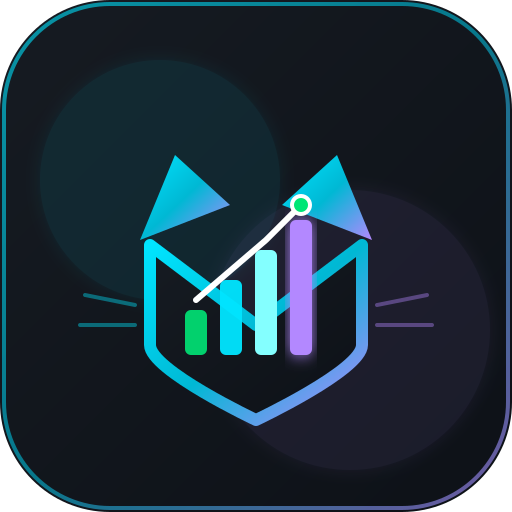

<p align="center">
  
</p>

<h1 align="center">MengFin — Smart Personal Finance & Wealth Tracker</h1>

<p align="center">
  <b>Aplikasi pelacak keuangan pribadi cerdas multiplatform (Android, Web, Desktop) bertenaga AI, auto-catat notifikasi perbankan, dan sinkronisasi cloud real-time.</b>
</p>

<p align="center">
  <a href="https://mengfin.vercel.app"></a>
  <a href="https://flutter.dev"></a>
  <a href="https://nodejs.org"></a>
  <a href="https://expressjs.com"></a>
  <a href="https://www.mongodb.com/atlas"></a>
  <a href="https://ai.google.dev"></a>
  
  
</p>

---

## 📌 Tentang MengFin

**MengFin** (gabungan *Meng* 🐾 & *Financial*) dirancang untuk memberikan kendali finansial penuh dengan antarmuka modern bernuansa *cyberpunk / dark glassmorphism*. MengFin menggabungkan kemudahan pencatatan transaksi harian dengan analitik cerdas berbasis Google Gemini AI serta integrasi pendengar notifikasi perbankan otomatis di perangkat Android.

> [!TIP]
> **Akses Cepat:**
> - 🌐 **Web App Live:** [https://mengfin.vercel.app](https://mengfin.vercel.app)
> - 📱 **Download APK Android:** [GitHub Releases](https://github.com/Mengggzz/mengfin-app/releases)

---

## 🌟 Fitur Utama

| Ikon | Modul / Fitur | Deskripsi |
| :---: | :--- | :--- |
| 📊 | **Smart Dashboard** | Ringkasan saldo seluruh dompet, *Financial Health Score*, estimasi saldo akhir bulan, serta grafik distribusi pengeluaran. |
| 💳 | **Kazz Dompet (Multi-Account)** | Kelola berbagai rekening bank, dompet digital (GoPay, OVO, ShopeePay), dan uang tunai. Dilengkapi kustomisasi warna dan filter per dompet. |
| ⌨️ | **Numpad Kalkulator Cerdas** | Keyboard angka built-in yang langsung mengevaluasi ekspresi matematika (`+`, `-`, `×`, `÷`) saat input nominal transaksi. |
| 🤖 | **MengFin AI Advisor** | Asisten finansial berbasis Google Gemini. Bisa diajak konsultasi tips hemat, analisa pola belanja, hingga input transaksi otomatis via teks santai. |
| 🔔 | **Auto-Catat Notifikasi** | Background service Android untuk mendeteksi notifikasi transfer/debit m-banking dan e-wallet, langsung mengubahnya jadi catatan transaksi. |
| 🔄 | **Offline-First & Auto-Sync** | Tetap bisa mencatat saat offline menggunakan database lokal SQLite (`sqflite`), otomatis sinkronisasi ke cloud MongoDB saat online. |
| 📅 | **Kalender Finansial** | Kalender visual untuk meninjau riwayat pemasukan dan pengeluaran harian secara cepat. |
| 📈 | **Anggaran & Target (Goals)** | Batasi pengeluaran per kategori dengan progress bar dinamis dan rencanakan tabungan impian dengan circular progress. |
| 📑 | **Laporan & Ekspor Data** | Analisis cashflow mingguan/bulanan serta fitur ekspor riwayat transaksi ke format **CSV** dan **PDF**. |
| 🌓 | **Dual Theme (Dark & Light)** | Tampilan responsif dengan tema gelap elegan dan tema terang bersih yang nyaman di mata. |
| 🚀 | **In-App Auto Update** | Deteksi otomatis rilis APK terbaru dari GitHub Releases langsung dari dalam aplikasi. |

---

## 🏗️ Arsitektur Proyek

Repository ini menggunakan arsitektur monorepo terstruktur:

```text
mengfin-app/
├── assets/                  # Logo, aset gambar, dan ikon aplikasi
├── backend/                 # REST API Node.js + Express + MongoDB
│   ├── src/
│   │   ├── config/          # Prompt sistem MengFin AI (Gemini)
│   │   ├── middleware/      # Auth JWT & validation middleware
│   │   ├── models.js        # Skema data Mongoose (Transaksi, Akun, Anggaran, Goal)
│   │   ├── routes/          # API route (auth, transaksi, akun, ai, laporan, dll.)
│   │   └── services/        # Integrasi Gemini AI, kalkulasi finance, dll.
│   └── package.json         # Dependensi backend
├── lib/                     # Aplikasi Utama Flutter (Frontend)
│   ├── constants/           # Design token (AppColors, AppTheme, config)
│   ├── models/              # Data model & serialization
│   ├── screens/             # UI Layar (Dashboard, Kazz, Transaksi, AI, dll.)
│   ├── services/            # API client, Local DB SQLite, Auto-sync, Notif
│   ├── utils/               # Format rupiah, date helper, responsive helper
│   ├── widgets/             # Reusable UI (GlassCard, Numpad, UpdateDialog)
│   └── main.dart            # Entry point aplikasi Flutter
├── test/                    # Unit testing & widget testing (126+ unit tests)
├── .github/workflows/       # CI/CD otomatis build & release APK ke GitHub Release
├── run.bat                  # Script one-click untuk menjalankan lokal (Backend + Web)
└── deploy.bat               # Script build web dan deploy otomatis ke Vercel
```

---

## 🛠️ Tech Stack & Ekosistem

### Frontend (Mobile & Web)
- **Framework:** [Flutter](https://flutter.dev) (Dart SDK `>=3.0.0 <4.0.0`)
- **State Management:** `provider`
- **Charts & Visuals:** `fl_chart`, `flutter_svg`, `google_fonts`
- **Offline Storage:** `sqflite` (Mobile) & `shared_preferences`
- **Device Features:** `notification_listener_service`, `speech_to_text`, `image_picker`
- **Document Export:** `csv`, `pdf`, `share_plus`

### Backend & Cloud
- **Runtime:** Node.js (v18+) & [Express.js](https://expressjs.com)
- **Database:** [MongoDB Atlas](https://www.mongodb.com/atlas) (Mongoose ODM)
- **AI Intelligence:** `@google/generative-ai` (Google Gemini SDK)
- **Authentication:** `jsonwebtoken` (JWT) & Google OAuth
- **Hosting / Deploy:** Railway Cloud (API Backend) & Vercel (Web Frontend)

---

## ⚡ Panduan Menjalankan Secara Lokal

### 1. Prasyarat
- [Flutter SDK](https://docs.flutter.dev/get-started/install) terpasang di komputer Anda.
- [Node.js](https://nodejs.org) (v18 atau lebih baru).
- Akun MongoDB Atlas (atau MongoDB lokal).
- Google Gemini API Key dari [Google AI Studio](https://aistudio.google.com).

---

### 2. Konfigurasi Backend

Masuk ke folder `backend` dan siapkan file konfigurasi environment:

```bash
cd backend
npm install
```

Buat file `.env` di dalam folder `backend/`:
```env
PORT=3000
MONGODB_URI=mongodb+srv://<username>:<password>@cluster.mongodb.net/mengfin?retryWrites=true&w=majority
JWT_SECRET=rahasia_jwt_super_aman_mengfin
GEMINI_API_KEY=AIzaSy...
```

Jalankan backend development server:
```bash
npm run dev
# Server aktif di http://localhost:3000/api
```

---

### 3. Konfigurasi Endpoint di Flutter

Sesuaikan konfigurasi API di file `lib/constants/config.dart`:

```dart
// Browser Web / Localhost:
const String kApiBaseUrl = 'http://localhost:3000/api';

// Android Emulator:
// const String kApiBaseUrl = 'http://10.0.2.2:3000/api';

// Perangkat Fisik (Ganti dengan IP Wi-Fi komputer Anda):
// const String kApiBaseUrl = 'http://192.168.1.X:3000/api';
```

---

### 4. Jalankan Aplikasi Flutter

Buka terminal di root project:

```bash
flutter pub get
flutter run -d chrome    # Untuk Web
# atau
flutter run -d android   # Untuk Perangkat / Emulator Android
```

> [!NOTE]
> Di Windows, Anda juga bisa menjalankan file **`run.bat`** yang akan otomatis menyalakan backend Express di port 3000 dan Flutter Web di port 8080 secara bersamaan.

---

## 🧪 Pengujian (Testing)

Proyek ini dilengkapi dengan rangkaian pengujian komprehensif (unit test, model test, UI event test, dan sync test):

```bash
flutter test
```
*Seluruh 126+ unit test tervalidasi lolos.*

---

## 🚀 CI/CD & Deployment

- **Android APK Build:** Terkonfigurasi otomatis di `.github/workflows/build.yml`. Setiap push ke branch `main` akan memicu kompilasi rilis APK dan mengunggahnya ke GitHub Releases.
- **Web App (Vercel):** Jalankan `deploy.bat` untuk mengompilasi Flutter Web dan men-deploy langsung ke Vercel Production.

---

## 📄 Lisensi

Didistribusikan di bawah lisensi **MIT License**.

<p align="center">
  Dibuat oleh <b>Mengggzz</b> • <i>Smart Wealth for Smarter Future</i>
</p>
